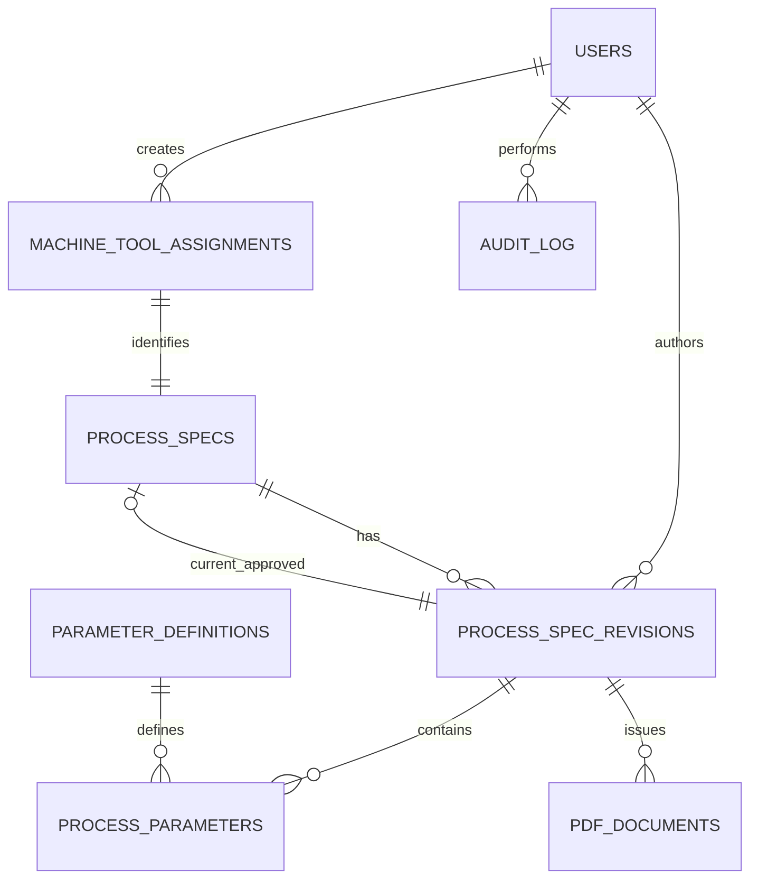

# Plán implementace technologických předpisů a operačních návodek

Stav: návrh pro diskusi, bez implementace aplikace. Vychází z `technologicke_predpisy_navodky.md` a aktuálního ProcessLogu v tomto repozitáři (15. 9. 2026).

## 1. Co už máme a co z toho plyne

ProcessLog je jedna Flask aplikace s SQLite, serverovými HTML šablonami a dvěma rolemi (`admin`, `technolog`). Ukládá jednotlivé procesní změny, jejich volně pojmenované parametry a audit úprav. Záznam změny lze přepisovat a administrátor ho může smazat. To je správná povaha deníku, ale není to model platného technologického předpisu.

Číselníky se dnes načítají read-only přes `scripts/sync_cyclades.py`: na `spc-vm` běží `sqlcmd` s přihlašovacími údaji z `~/cyclades-db.env`, výsledky se importují do lokálních tabulek SQLite. Zdrojové dotazy čtou `SUIVPRO.dbo.MACHINE` (`MAC_REFMAC`, `MAC_LIBMAC`) a `SUIVPRO.dbo.LISTE_OUTILS` (`OUT_REFOUT`, `OUT_LIBOUT`, `OUT_TYPEOUT`). Aktuální import používá **kódy** jako klíče, nikoli ověřená interní ID MES. Lokální tabulky ProcessLogu navíc umožňují ručně doplněné stroje a nástroje; ty nesmějí být zdrojem pro nový předpis.

Po sepsání plánu byla do repozitáře dodána jedna vzorová PDF návodka (`U10_3045_ON_260728_900-002_Schwarz.pdf`). Ukazuje členění a část používaných hodnot, ale bez dalších návodů a zdrojových Excelů nelze uzavřít definitivní katalog parametrů, povinná pole, jednotky ani postup převodu historických předpisů.

## 2. Navržená hranice systému

V první fázi přidat do stejného repozitáře samostatnou aplikaci předpisů (`specs/backend` FastAPI, `specs/frontend` React/TypeScript, PostgreSQL). ProcessLog ponechat funkční a jeho SQLite automaticky nepřevádět. Obě aplikace mohou být dostupné pod jedním interním hostem a navigací; sjednocení přihlášení je samostatné rozhodnutí po potvrzení firemního AD/LDAP/SSO. Není vhodné přímo sdílet současnou Flask session ani předpokládat, že `display_name` odpovídá oddělenému jménu a příjmení.

Cyklades je autorita pro identitu a aktuální názvy strojů a nástrojů. PostgreSQL předpisů ukládá pouze stabilní reference na MES a **nemá ručně spravované tabulky `machines` a `tools`**. Historická schválená revize ovšem musí nést neměnný snímek kódu a názvu stroje/nástroje pro opakované vytvoření stejné návodky i po přejmenování v MES. Snímek není druhý číselník.

Procesní kontrola, PLC a hodnoty stroje jsou mimo první verzi. Rozhraní pro čtení schváleného předpisu se navrhne tak, aby je později mohla využít, ale nesmí ještě zapisovat do předpisu.

## 3. Pravidla a stavový model

- Jeden předpis na kombinaci stroj–nástroj; nástroj může mít více strojů. Jestli předpis závisí také na výrobku nebo materiálu, je nutné změnit klíč ještě před migrací databáze.
- `process_specs.current_approved_revision_id` ukazuje na poslední schválenou revizi. Při přípravě další revize ukazatel zůstává na předchozí platné revizi.
- Stav patří revizi: `DRAFT → IN_REVIEW → APPROVED`; vrácení ze schvalování vede zpět do `DRAFT` se záznamem důvodu. Zrušení rozpracované revize vede do `CANCELLED`. `process_specs.lifecycle` je pouze `ACTIVE`/`OBSOLETE`, aby se nemíchala existence platného předpisu se stavem právě připravované revize.
- Nejvýše jedna otevřená revize (`DRAFT` nebo `IN_REVIEW`) na předpis. Nová revize vzniká kopií poslední schválené revize. Schválenou revizi a její hodnoty žádné UPDATE/DELETE API nemění. Číslo revize je jedinečné v rámci předpisu a přiděluje se v transakci.
- Schválit smí `APPROVER` nebo `ADMIN`; u vybraných předpisů může firma požadovat zákaz schválení vlastní revize — potvrdit. Přechod stavu, změna ukazatele a audit se provedou v jedné databázové transakci. API přechod odmítne, pokud revize mezitím změnila verzi (`409 Conflict`).
- PDF pro pracoviště se generuje výhradně z `current_approved_revision_id`; historické PDF lze stáhnout podle konkrétního ID schválené revize. U schválené revize se uchová snímek MES údajů, názvů parametrů a jednotek. Vydaný soubor se archivuje s verzí šablony, SHA-256 a cestou k souboru; zápis do `pdf_documents` následuje až po úspěšném uložení PDF, protože soubor a databázový řádek nemohou být jedna atomická transakce.
- Časy ukládat jako `timestamptz` v UTC, v UI/PDF zobrazovat firemní časové pásmo. Důvod změny je povinný u nové revize a u vrácení ke zpracování.

## 4. PostgreSQL schéma pro první verzi

Následující návrh je konkrétní základ migrací Alembic; názvy MES klíčů a definitivní katalog se uzavřou až po ověření zdroje. Primární klíče jsou `bigint GENERATED ALWAYS AS IDENTITY`; MES reference jsou `text`, dokud nepotvrdíme, zda jsou kódy stabilním klíčem nebo máme používat jiné sloupce. Všechny FK jsou `ON DELETE RESTRICT`, u revizí/auditu se neprovádí kaskádové mazání.

| Tabulka | Sloupce a význam | Klíčová omezení/indexy |
| --- | --- | --- |
| `users` | `id`, `username text`, `first_name text`, `last_name text`, `email text`, `password_hash text NULL`, `role text`, `is_active boolean`, `created_at`, `updated_at` | `UNIQUE lower(username)`, `UNIQUE lower(email)` pro neprázdný e-mail; `CHECK role IN ('ENGINEER','APPROVER','ADMIN')`; účty se deaktivují, nemažou. `password_hash` je přechodná lokální autentizace; při SSO může být NULL. |
| `machine_tool_assignments` | `id`, `mes_machine_ref text`, `mes_tool_ref text`, `is_active boolean`, `created_by FK users`, `created_at` | `UNIQUE(mes_machine_ref, mes_tool_ref)`; neprázdné reference; existence obou ID a případné platné spojení se ověřuje proti MES v aplikační vrstvě. |
| `process_specs` | `id`, `assignment_id FK`, `lifecycle text`, `current_approved_revision_id FK NULL`, `created_by FK`, `created_at`, `updated_by FK`, `updated_at` | `UNIQUE(assignment_id)`; `CHECK lifecycle IN ('ACTIVE','OBSOLETE')`. FK ukazatele musí mířit na `APPROVED` revizi **téhož předpisu** — řešit transakčním triggerem nebo kontrolou v databázové funkci, nestačí prostý FK. |
| `process_spec_revisions` | `id`, `process_spec_id FK`, `revision_number integer`, `status text`, `change_reason text`, `product_name text`, `material_name text NULL`, `process_note text NULL`, `mes_machine_code/name text NULL`, `mes_tool_code/name text NULL`, `created_by FK`, `created_at`, `updated_at`, `submitted_at`, `approved_by FK NULL`, `approved_at NULL`, `returned_by FK NULL`, `returned_at NULL`, `return_reason text NULL`, `row_version integer` | `UNIQUE(process_spec_id, revision_number)`, `CHECK revision_number > 0`, `CHECK status IN ('DRAFT','IN_REVIEW','APPROVED','CANCELLED')`; partial unique index na `process_spec_id WHERE status IN ('DRAFT','IN_REVIEW')`; schválení vyžaduje výrobek, MES snapshot pole a schvalovatele/datum. `row_version` pro optimistické zamykání. |
| `parameter_definitions` | `id`, `code text`, `name text`, `description text NULL`, `category text`, `value_type text`, `unit text NULL`, `position_kind text`, `sort_order integer`, `is_required boolean`, `is_active boolean`, `created_at`, `updated_at` | `UNIQUE(code)`; `CHECK value_type IN ('NUMERIC','TEXT','BOOLEAN')`; `CHECK position_kind IN ('NONE','SEQUENCE','LABEL')`; katalog se deaktivuje, nemazává. Změna významu/rozměru jednotky znamená nový `code`, ne editaci existujícího. |
| `process_parameters` | `id`, `revision_id FK`, `definition_id FK`, `position_key text NOT NULL DEFAULT ''`, `position_label text NULL`, `sort_order integer`, `numeric_target numeric(14,4) NULL`, `numeric_min numeric(14,4) NULL`, `numeric_max numeric(14,4) NULL`, `text_value text NULL`, `boolean_value boolean NULL`, `unit text NULL`, `note text NULL`, `definition_code/name/category/type text`, `created_at` | `UNIQUE(revision_id, definition_id, position_key)`; `CHECK numeric_min <= numeric_target <= numeric_max` tam, kde jsou vyplněné; pouze jeden typ hodnoty podle zmrazeného `definition_type`; aplikace vynutí povinné parametry i úplnost. Tolerance `±` se při zápisu přepočte na min/max, aby každé API/PDF používalo stejný rozsah. |
| `audit_log` | `id`, `actor_id FK`, `entity_type text`, `entity_id bigint`, `action text`, `before_data jsonb NULL`, `after_data jsonb NULL`, `reason text NULL`, `created_at` | Index `(entity_type, entity_id, created_at)`; pouze INSERT, žádná mutace ani mazání běžným účtem aplikace; neukládat hesla/tajné údaje. Logovat i vytvoření, odeslání, vrácení, schválení, zneplatnění, vydání PDF. |
| `pdf_documents` | `id`, `revision_id FK`, `template_version text`, `storage_key text`, `sha256 text`, `generated_at`, `generated_by FK` | `UNIQUE(revision_id, template_version)` pro vydaný dokument; binární soubor v interním persistentním úložišti, ne v databázových hodnotách parametrů. Nutno rozhodnout, zda je oficiální výtisk vždy archivovaný soubor nebo deterministicky generovaný na vyžádání. |

Poznámky ke schématu: `numeric(14,4)` je pracovní přesnost, kterou ověří skutečné návody. U profilů se opakovaný parametr rozlišuje stabilním `position_key` (`1`, `2`, `NOZZLE`), zobrazeným `position_label` a pořadím. Volná textová poznámka je samostatná od číselné tolerance. Při změně jednotek lze provést výslovnou konverzi při nové revizi; historická jednotka zůstane ve snapshotu. Datum vydání není datum tisku, ale datum schválení nebo určené datum účinnosti — potvrdit, zda je potřeba `effective_from`.

Databázové triggery doplní obranu proti změně nebo smazání `APPROVED` revize a jejích parametrů, kontrolu platného ukazatele v `process_specs` a zákaz UPDATE/DELETE auditu. Aplikační účet nedostane oprávnění tyto triggery obcházet.

### ER diagram



MES reference jsou ve `machine_tool_assignments`. Vazba na `MACHINE` a `LISTE_OUTILS` je ověřována integračním adaptérem, ne cizím klíčem mezi databázemi.

## 5. API první verze

JSON pod `/api/v1`; seznamy stránkovat a filtrovat. Zápisy vyžadují přihlášení, oprávnění a audit. `ETag`/`row_version` ve změnových požadavcích chrání před souběžným přepisem. Chybové odpovědi odlišují neplatná data (`422`), chybějící objekt (`404`), zákaz (`403`), konflikt (`409`) a nedostupné MES (`503`).

| Endpoint | Účel / oprávnění |
| --- | --- |
| `POST /auth/login`, `POST /auth/logout`, `GET /auth/me` | Přechodné interní přihlášení; připravit výměnu za SSO. Session v bezpečné HttpOnly cookie, pro zápis CSRF ochrana. |
| `GET /mes/machines?q=`, `GET /mes/tools?q=`, `GET /mes/assignments?machine_ref=` | Read-only hledání v Cyklades; poslední endpoint jen pokud MES skutečně zná povolené kombinace. Výsledky vrací MES identitu, kód a název. |
| `GET /parameter-definitions`, `POST /parameter-definitions`, `PATCH /parameter-definitions/{id}` | Katalog; zápis pouze ADMIN, včetně deaktivace. |
| `GET /specs?machine_ref=&tool_ref=&status=`, `POST /specs`, `GET /specs/{id}` | Výběr a vytvoření předpisu; založení kontroluje identity v MES. |
| `GET /specs/{id}/revisions`, `GET /specs/{id}/revisions/{revision_id}`, `POST /specs/{id}/revisions` | Historie a kopie schválené revize do nového draftu. |
| `PUT /revisions/{id}/draft`, `POST /revisions/{id}/submit`, `POST /revisions/{id}/return`, `POST /revisions/{id}/approve`, `POST /revisions/{id}/cancel` | Uložení celého draftu včetně parametrů; stavové přechody s důvodem, rolí a verzí řádku. Schválený obsah nemá zápisový endpoint. |
| `GET /specs/{id}/current`, `GET /revisions/{id}/audit` | Platná schválená data a audit. `current` vrací stabilní strukturované hodnoty pro budoucí procesní kontrolu. |
| `GET /specs/{id}/current/pdf`, `GET /revisions/{id}/pdf` | Vydaná aktuální nebo historická operační návodka; jen schválené revize. |
| `POST /specs/{id}/obsolete`, `GET /admin/users`, `POST /admin/users`, `PATCH /admin/users/{id}` | Zneplatnění předpisu a administrace účtů. |

## 6. Napojení na Cyklades

1. Read-only ověřit schéma a několik reálných řádků z `SUIVPRO.dbo.MACHINE` a `SUIVPRO.dbo.LISTE_OUTILS` na `spc-vm`. Současné dotazy potvrzují *názvy sloupců používané ProcessLogem*, ne to, že `MAC_REFMAC` a `OUT_REFOUT` jsou neměnné a jedinečné ID. Ověřit klíče, neaktivní položky, duplicitní kódy, změny názvu a případnou tabulku/pohled vazby stroj–nástroj.
2. Zvolit jediný MES adaptér s operacemi `search_machines`, `search_tools`, `get_machine`, `get_tool`, případně `get_allowed_tools(machine_ref)`. Používat parametrizované SQL, časový limit, read-only účet a diagnostiku. Nemíchat MES dotazy s transakcemi PostgreSQL.
3. Produkčně preferovat přímé read-only spojení backendu na SQL Server, **pokud** se potvrdí síťová dostupnost z Dockeru a způsob předání přihlašovacích údajů bez uložení do image/repa. Pokud přímé spojení nelze, upravit existující `spc-vm` mechanismus na interní čtecí službu nebo host agent; nevolat pro každý autocomplete nový `docker run`/SSH. Stávající `sqlcmd` export je vhodný pro ověření zdroje a případnou inicializaci, ne jako per-request API.
4. Pro přechodný výpadek MES dovolit čtení již schválených revizí a historických PDF ze snapshotů. Nový předpis a schválení další revize by měly vyžadovat ověření aktuální identity; pravidlo pro vyřazený stroj/nástroj je nutné potvrdit s procesním inženýrem.

## 7. Docker Compose a provoz

Navržené doplnění vedle současného `compose.yml` (např. `specs/compose.yml`, později společný reverse proxy):

```yaml
services:
  specs-db:
    image: postgres:<pinned-version>
    volumes: [specs_pgdata:/var/lib/postgresql/data]
    environment:
      POSTGRES_DB: specs
      POSTGRES_USER: specs
      POSTGRES_PASSWORD: ${SPECS_DB_PASSWORD}
    healthcheck: {test: ["CMD-SHELL", "pg_isready -U specs -d specs"], interval: 5s, retries: 10}
  specs-api:
    build: ./backend
    environment:
      DATABASE_URL: ${SPECS_DATABASE_URL}
      SESSION_SECRET: ${SPECS_SESSION_SECRET}
      MES_CONNECTION_MODE: ${MES_CONNECTION_MODE}
    depends_on:
      specs-db: {condition: service_healthy}
    volumes: [specs_pdf:/data/pdf]
  specs-web:
    build: ./frontend
    depends_on: [specs-api]
  # Interní reverse proxy směruje web/API pod jedním hostem;
  # PostgreSQL a MES spojení nejsou publikovány do internetu.
volumes:
  specs_pgdata:
  specs_pdf:
```

Při implementaci doplnit `.env.example` bez hesel, skutečné Docker secrets/env pouze na serveru, verzovanou migraci Alembic, health endpointy, zálohu/obnovu PostgreSQL a PDF úložiště, logování, HTTPS/reverse proxy. Migrace se spouští jako explicitní nasazovací krok, ne při každém HTTP requestu. ProcessLog má vlastní SQLite volume; data a zálohy předpisů se drží odděleně.

## 8. Pořadí práce a ověřitelné výstupy

| Etapa | Práce | Hotovo, když |
| --- | --- | --- |
| 0. Potvrzení vstupů | Read-only kontrola MES schématu a ID; rozbor několika reálných Excelů a podepsaného PDF; rozhodnutí o výrobku/materiálu, tolerancích, schvalování a SSO. | Existuje tabulka mapování Excel polí na kódy/typy/jednotky/pozice a schválená šablona návodky. |
| 1. Datový základ | FastAPI, PostgreSQL, Alembic, MES adaptér, přihlášení/role, katalog parametrů, testovací data pouze pro vývoj. | Lze vyhledat skutečný MES stroj/nástroj; duplicitní nebo neplatná reference se odmítne; migrace běží na prázdné i existující DB. |
| 2. Předpisy a revize | Založení vazby, draft, strukturované parametry, pozice, tolerance, kopie schválené revize, přehled a historie v UI. | Inženýr vytvoří a uloží předpis včetně profilů; stará schválená revize zůstane totožná po editaci nové. |
| 3. Schválení a audit | Odeslání, vrácení, schválení, role, konflikty souběžných úprav, audit a zneplatnění. | Nepovolané schválení selže; po schválení se atomicky změní platný ukazatel; lze doložit kdo/kdy/proč změnil každou hodnotu. |
| 4. Návodka a nasazení | Česká PDF šablona podle skutečného vzoru, archiv/otisk, tisk, zálohování, interní reverse proxy, provozní návod. | PDF aktuální i starší revize obsahuje identitu, revizi, autora/schvalovatele a všechny hodnoty; vizuální kontrola vytištěného vzoru a obnovy zálohy projde. |

Při každé etapě testovat invariants databáze, oprávnění, souběžné schválení a selhání MES; u PDF vizuálně kontrolovat všechny stránky, české znaky, čitelnost a přenos dlouhých poznámek. Převod historických Excelů řešit odděleným importem s kontrolním reportem, ne jako automatickou domněnku o jejich významu.

## 9. Nejasnosti, které rozhodují o schématu

1. Jsou `MAC_REFMAC` a `OUT_REFOUT` trvalé unikátní identifikátory, nebo MES poskytuje jiné stabilní ID? Existuje v MES skutečná vazba aktuálně povoleného stroje a nástroje?
2. Je technologický předpis skutečně unikátní jen pro dvojici stroj–nástroj, nebo pro stejnou dvojici existuje více výrobků, materiálů, variant či dutin?
3. Které parametry, jednotky, profily, tolerance a slovní instrukce musí být v první návodce? Potřebujeme několik skutečných Excelů včetně výjimečných strojů a aktuální PDF/papírový vzor.
4. Kdo je schvalovatel, může schválit vlastní návrh, má schválení elektronický podpis nebo navazuje na fyzický podpis výtisku? Jak se stanoví datum účinnosti a kdy se předpis označí za zastaralý?
5. Bude přihlášení nové aplikace lokální, přes současné účty ProcessLogu, nebo firemní SSO? Jaké je požadované období uchování revizí a PDF?
6. Má být vydané PDF archivovaný neměnný artefakt, a jak přesně se budou převádět staré Excelové předpisy včetně jejich revizí?

Začít implementovat po uzavření bodů 1–3; jinak hrozí migrace základního klíče a ztráta významu hodnot. Ostatní body lze v první iteraci vyřešit přechodným pravidlem, ale musí být výslovně uvedené v akceptaci.
